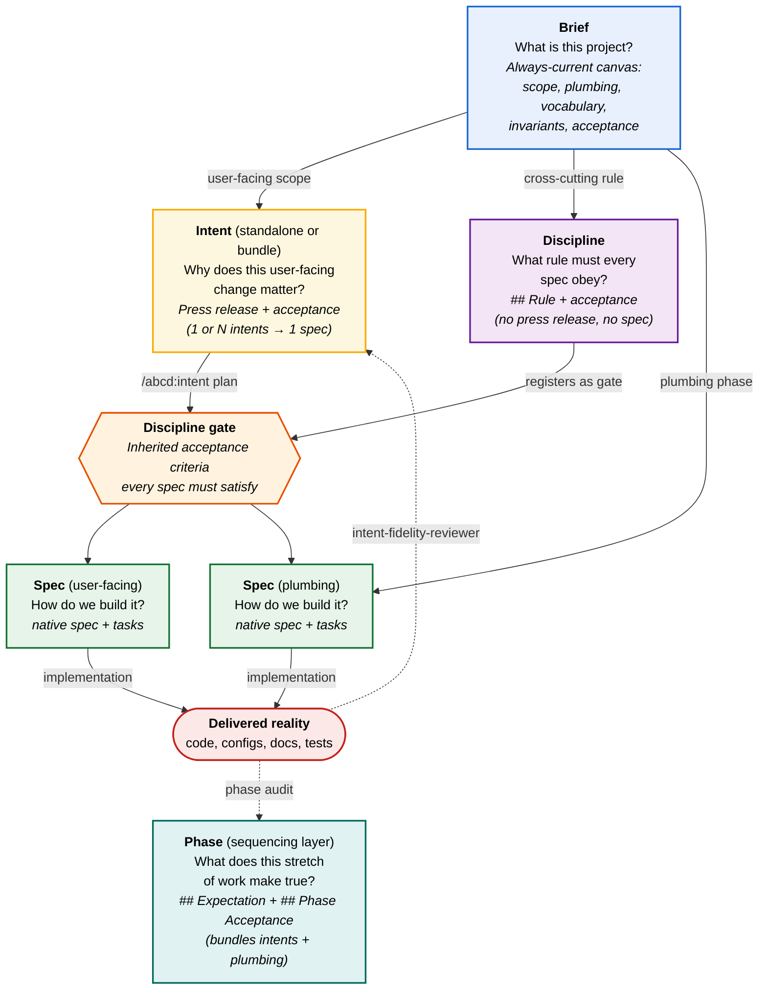

# Four-Layer Mental Model

abcd uses four layers to organise development work, each tuned to the kind of question it answers. Three are the original design layers — brief, intent, spec; the fourth, **phase**, is the sequencing-and-reflection layer added per [adr-9](../../decisions/adrs/0009-phase-as-product-layer.md). The diagram below shows the brief → intent → spec flow into delivered reality, with the phase as the audit target of delivered reality; the phase layer is explained in full after it.

**Reading the diagram.** The brief sits at the top — it's the shared canvas, and per [adr-5](../../decisions/adrs/0005-brief-is-current-state.md) it's always the current state, not a versioned artefact. Three paths lead down: user-facing scope flows through an *intent* (press-release-shaped, why-driven; standalone or bundle) before reaching a spec; *discipline* intents capture cross-cutting rules (no user moment, no spec of their own) and register as inherited gates that every other spec must satisfy; plumbing scope skips the intent surface (because plumbing has no user moment to press-release) but still passes through the discipline gate. Both spec kinds produce *delivered reality*. The dotted arrows are the audit feedback loop: `intent-fidelity-reviewer` compares reality against the intent's `## Acceptance Criteria`; the phase audit compares reality against the phase's `## Phase Acceptance` (see the phase layer below). The format of acceptance is uniform across all surfaces; the *home* differs.

**The phase layer.** The diagram's `Phase` node is the fourth layer — it wraps the other three on the sequencing axis. A phase is an ordered stretch of work that ends in a milestone; it bundles a set of intents and brief plumbing-phases and re-states, in user terms, *what that stretch is expected to make true*. Phases live in [`roadmap/phases/`](../../roadmap/phases/README.md). Mirroring an intent's press-release-then-`## Acceptance Criteria` shape one grain up, each phase doc carries a prose `## Expectation` (working-backwards, at phase granularity — coarser than one intent's press release, finer than the whole brief) **and** a structured `## Phase Acceptance` (Given-When-Then bullets). The `phase:` spec anchor described in adr-9 — the mechanism that will make the **phase audit** runnable (when every spec in a phase closes, delivered reality is reviewed against the phase's `## Phase Acceptance`, the same fidelity shape one grain up from the intent audit) — is **deferred, bundled with the phase-audit tooling that reads it**, not a standing convention today. Current phase membership is reconstructed editorially from each phase doc's `## Scope`. Phase acceptance is a *roll-up*: each bullet asserts an emergent, cross-intent truth or a phase-spanning journey, never a copy of an intent's own acceptance. abcd thus has three audit grains of one shape: brief audit (vs. brief-phase acceptance), phase audit (vs. phase acceptance), intent audit (vs. intent acceptance). See [adr-9](../../decisions/adrs/0009-phase-as-product-layer.md) and its amendment.

**The brief** answers *what is this project as a whole?* It's the shared canvas — the document you'd hand a new collaborator to understand the scope, the user-facing capability, and the plumbing infrastructure that makes that capability possible. Plumbing infrastructure (adapters, agents, hooks, scaffolding) lives here because it has no user moment of its own; it exists *to enable* user-facing capability.

**Intents** answer *why does each user-facing change matter?* Most intents are press-release-shaped (Amazon working-backwards) to force product-thinking before engineering scope — written in present tense as if already shipped, with a customer quote from the persona registry. Intents are individually portable — they live as standalone documents at `.abcd/development/intents/{drafts,planned,shipped,disciplines,superseded}/`, so they can be reordered, bundled into milestones, moved to a later phase, or killed without disturbing the brief or each other. The "why" emphasis is load-bearing — it's what disciplines product clarity when scope creep tries to enter through the engineering door.

**Three kinds of intent.** Not every intent maps cleanly to "one user moment, one spec." Three structural kinds exist:

- **`standalone`** — one press-release-shaped user moment, ships as one spec. The default; ~60% of the corpus. Lives in `drafts/` → `planned/` → `shipped/`.
- **`bundle-member`** — one of several intents that *only make sense delivered together*. Each member has its own press release (each captures a distinct user moment), but they share underlying delivery. `/abcd:intent plan` accepts multiple intent IDs and creates a single spec with `intent: [itd-A, itd-B]`. Members declare their bundle in frontmatter (`bundle: <bundle-id>`).
- **`discipline`** — a cross-cutting rule with no user moment of its own; applies to *every other spec* as an inherited acceptance gate. Lives in `disciplines/` (not `drafts/`); never gets its own spec; never ships in the user-facing sense. Examples: itd-1 (acceptance-criteria gate), itd-5 (prompt-quality additions). This kind is project-agnostic — application projects (e.g., a macOS app under abcd) produce their own disciplines (privacy-impact review, accessibility passes, code-style conventions).

**Why typing matters.** The 1:1-only model (every intent = one spec) forces bundle-shaped work into separate specs that redo each other's plumbing, and forces discipline-shaped rules into "specs" whose only deliverable is "every other spec inherits this gate." Both shapes calcify into wrong fits. The three kinds let each intent's *delivery shape* match its *forward-looking shape* without forcing one onto the other.

**The seven phases target thirteen intents across two of the three kinds:** ten standalone (itd-2, itd-3, itd-4, itd-6, itd-7, itd-27, itd-28, itd-34, itd-36, itd-40) and three disciplines (itd-1, itd-5, itd-37). The `bundle-member` kind exists in the framework but isn't currently exercised — the corpus has zero live bundles. See [`phases/README.md`](../../roadmap/phases/README.md) for the phase plan and each phase's intent scope, [`intents/README.md`](../../intents/README.md) for the intent index, and that file's § Bundles for the retired-bundle history.

**Classification happens at plan time.** Capture stays cheap and format-neutral (`/abcd:intent "<text>"` produces a press-release-shaped draft regardless of eventual kind, with an optional advisory `suggested_kind` hint from the LLM classifier). The binding `kind` field is set at `/abcd:intent plan` time, when the user is committing to *build* the thing — that's when the shape decision has to be true. A continuous audit role (the third role on `intent-fidelity-reviewer`, see [`05-internals/01-agents.md`](../05-internals/01-agents.md)) suggests reclassifications when patterns emerge in the corpus over time.

**A fourth capture verdict: `decision` (routes to the ADR store, never a fourth kind).** The persisted `kind` enum stays **three-valued**. But the corpus also produces a shape none of the three fit cleanly: a *standing infrastructure choice* — "we use Postgres", "the build system is Bazel" — with no user moment and no per-artefact rule. The capture-time classifier (`intent classify-capture-kind`, itd-44) recognises this signature and emits a fourth **verdict**, `decision`. A confirmed `decision` routes capture to the existing **ADR store** (`.abcd/development/decisions/adrs/`, `adr-N-<slug>.md`) — *what an industry engineer calls an ADR, a product thinker calls an intent* — never to a new intent lifecycle and never to a persisted `kind: decision` (which would be an enum value with no lifecycle directory). Because a false positive would silently write an ADR, the verdict is **advisory**: capture confirms "capture as an ADR?" or overrides to a normal draft carrying a *plannable* `suggested_kind` (never `decision`). `decision` is admitted by `suggested_kind` (the advisory hint) and by the classifier, but REFUSED by `plan_single`/`reclassify`. This avoids a second store for a class the repo already curates well, honouring single-source-of-truth (see [itd-44](../../intents/drafts/itd-44-fourth-intent-kind-decision.md) and [adr-2](../../decisions/adrs/0002-three-intent-kinds.md)).

**The first formal discipline subtype: framework-provided vs app-authored.** A discipline is now typed by *who authors it and how it enters the corpus*, recorded in a `discipline_kind` field:

- **`app-authored`** — the disciplines the brief has had all along (itd-1, itd-5, itd-37): a cross-cutting *rule* an abcd-project author writes, promoted from a `drafts/` intent through `/abcd:intent plan` (or `reclassify`), gate-registered keyed by `itd-<N>` under `.abcd/disciplines/`. This is the default: a `kind: discipline` intent with no `discipline_kind` is read as `app-authored` (the field is additive — no migration of existing disciplines).
- **`framework-provided`** — a *validation discipline* the framework ships (itd-62 / spc-76): it wraps an unmodified external scanner and validates the downstream app the amateur builds, rather than encoding an authored rule. It is NEVER promoted from a `drafts/` intent; it is registered through the validation-gate registry, keyed by a distinct NAME (matching `^[a-z][a-z0-9-]*$`, forbidden from the `itd-<N>` key space and from any path-traversal char) under a separate directory, `.abcd/validation_disciplines/<name>.json`. The two key spaces never collide. This is governed by the itd-60/61 doc-fidelity + derivation loop — itd-62 is that loop's first real exercise.

This is the *authoring-origin* axis and is a closed two-value split. The finer-grained taxonomy of what a discipline *does* (e.g., `methodology` / `documentation` / `audit`) is still deliberately deferred: each discipline keeps its free-text `kind_notes`, and that taxonomy moves from free-text to formal enum only once the corpus contains enough samples to cluster meaningfully — see the revisit triggers in [`04-surfaces/05-intent.md`](../04-surfaces/05-intent.md).

**Specs** answer *how do we build this concrete thing?* They live in the native spec store as specs and tasks ([adr-26](../../decisions/adrs/0026-native-spec-layer-ccpm-backend.md); the companion harness `ccpm` as the deeper backend), are plan-reviewed before work starts, completion-reviewed after work finishes, and trace back to *something* — either one or more intents (for user-facing work; standalone or bundle), or a brief phase (for plumbing), or a discipline being made concrete in a particular spec's acceptance criteria (for cross-cutting rules). That trace is what keeps the project auditable.

**Acceptance discipline applies uniformly across the boundary.** Every standalone or bundle-member intent's press release is followed by a `## Acceptance Criteria` block in Given-When-Then format (per the itd-1 discipline). Every brief phase has an `## Acceptance` block in the same format. Discipline-kind intents skip the press release but use the same Given-When-Then format under a `## Rule` heading — the gate they impose on every other spec. The `intent-fidelity-reviewer` agent compares delivered reality against intent acceptance; the same agent's discipline role checks every spec against the active disciplines; the phase audit compares reality against the phase's `## Expectation`. The format is uniform; the *home* differs to match the nature of the work.

**Why most intents are still press-release-shaped.** Press-release format requires a user moment ("abcd ships X — Bob, staff engineer, says..."). Plumbing has no user moment — Pass A spine agents, harness Protocol, adapter dispatchers — these exist to make user-facing work possible, not to be experienced by users directly. Forcing press-release format on plumbing produces strained or mistargeted prose. Disciplines have no user moment either (a rule is not a feature). The brief is the right home for plumbing; the `disciplines/` directory is the right home for disciplines; press-release-shaped `drafts/` is the right home for everything that has a real user moment to announce.

## The Naurian gap — Modification axis

Peter Naur's "Programming as Theory Building" (1985, [gwern.net/doc/cs/algorithm/1985-naur.pdf](https://gwern.net/doc/cs/algorithm/1985-naur.pdf)) names three areas of tacit knowledge that source code, docs, and tests cannot capture: **Mapping** (how the world maps to the program), **Justification** (why each load-bearing decision was made; alternatives rejected), and **Modification** (what extends cleanly, what breaks the design, the structural rules). When all the people who hold the theory leave, the program enters Naur's "dead" state — no longer intelligently modifiable from the artefacts alone.

abcd already covers Mapping (press release + acceptance criteria) and Justification (audit notes + open questions + brief decisions + reclassification history) partially. **The Modification axis is the genuinely new gap** — abcd had no surface that asked "how should this be extended? what shape of change is in keeping with the theory? what shape would violate it?" The discipline `itd-37` (Modification Grammar) closes this: every spec carries a `## Modification Grammar` section with three sub-headings (`Extends cleanly` / `Breaks the design` / `Why`), extracted by `principle-distiller` at spec completion into typed memory pages (per `itd-36`'s page-class enum).

**Recovery humility, per Naur.** abcd's lifeboat is the highest-fidelity floor we can leave behind — *not* the theory itself. The theory of any non-trivial project lives in the people who built it, the conversations where decisions were made, and the alternatives they rejected before this one. The disembark/embark surfaces (see [`04-surfaces/02-disembark.md`](../04-surfaces/02-disembark.md), [`04-surfaces/03-embark.md`](../04-surfaces/03-embark.md)) name this explicitly: when something in the lifeboat doesn't make sense, hunt the originating session before trusting the lifeboat blindly.

## The project is a growing system

abcd is itself a growing system that shows the symptoms of all growing systems: surface count grows (the user-facing command design target — `/abcd:ahoy`, `/abcd:disembark`, `/abcd:embark`, `/abcd:launch`, `/abcd:intent`, `/abcd:capture`, `/abcd:memory` — plus many sub-verbs); agent count grows (the catalog already lists more than a dozen agents, several with multiple roles each — see [`05-internals/01-agents.md`](../05-internals/01-agents.md)); cross-cutting concerns proliferate (three disciplines: itd-1, itd-5, itd-37); internal vocabulary grows (`lifeboat`, `voyage`, `logbook`, `discipline`, `kind`, `surface_history`, `page class`, `source class`, `quotation budget`, …). Every term adds expressive power AND opacity for newcomers.

Three failure modes the brief actively guards against:

- **Vocabulary drift.** New terms get coined per spec without registration. itd-37's `## Ripple` axis (vocabulary delta sub-bullet) plus the [vocabulary-registration requirement in `02-constraints/04-naming.md`](../02-constraints/04-naming.md) make this hard from the start: every term introduced in a spec's ripple must appear in the glossary in the same spec. Lint blocks at plan-review.
- **Surface drift.** Command names and counts drift across documents (e.g., `/abcd:audit` vs `/abcd:intent` sub-verb migrations). itd-48's cross-document fidelity reviewer Role 2 (which superseded itd-31) catches this; the [bare-command-as-render discipline in `02-constraints/04-naming.md`](../02-constraints/04-naming.md) prevents the most common drift source by ruling `<verb> show`/`stats`/`list` out of the namespace at design time.
- **Coupling drift.** Each spec's `## Modification Grammar > Ripple` sub-bullet documents what newly couples to or depends on this spec — `principle-distiller` aggregates these per-domain so cross-cutting coupling is visible without walking every shipped spec.

These guards are not a separate discipline (idea-3's standalone `system-impact awareness` collapsed into itd-37 as the `## Ripple` axis after RP review — same retrieval key as modification grammar; no separate identity to maintain).

This is the answer to the recurring tension between "intent-driven" abcd and the substantial plumbing-and-discipline surface abcd ships. All three belong; they just have different homes and different formats. The brief sets scope; intents pin the user-facing why (in three kinds); specs handle the how — with discipline-shaped intents naming the rules every other spec inherits.
