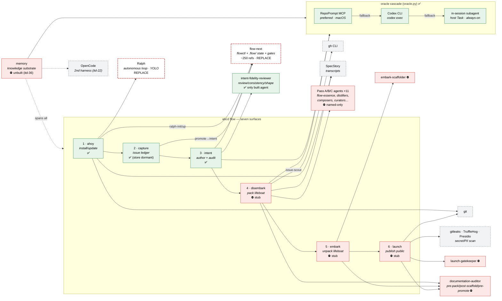

# abcd Lineage — Flow × Dependencies × Roles

Generated from a review of the abcd codebase, brief (`.abcd/development/brief/`),
and intent corpus (48 intents) on 2026-06-02.

**How to read this table.** Columns are the abcd flow stages (the seven
user-facing surfaces, left-to-right in lifecycle order: install → author intent →
capture issues → pack → unpack → publish, with `memory` as a cross-cutting
substrate). Rows group into three bands: **external dependencies** (what each
stage shells out to or delegates to), **roles** (the agents that run in each
stage), and a **description / status** band.

Legend — dependency cells: `●` hard/required · `○` optional/fallback ·
`▷` delegates-to (plugin-preferred) · `—` not used.
Status: ✅ built · ◑ partial · ⛔ stub/unbuilt.

---

## Flow stages (columns)

| | **ahoy** | **intent** | **capture** | **disembark** | **embark** | **launch** | **memory** |
|---|---|---|---|---|---|---|---|
| **Stage role** | install / update | author + audit intents | issue ledger | pack a lifeboat | unpack a lifeboat | publish to public repo | curated knowledge substrate |
| **Lifecycle order** | 1 | 3 | 2 | 4 | 5 | 6 | cross-cutting |
| **Status** | ✅ built | ✅ built | ✅ built (store dormant) | ⛔ probe-only stub | ⛔ probe-only stub | ⛔ render-only stub | ⛔ unbuilt (itd-36) |

### External dependencies (rows)

| External dependency | ahoy | intent | capture | disembark | embark | launch | memory |
|---|---|---|---|---|---|---|---|
| **flow-next** (`flowctl`, `.flow/` state, gates) — *vendored, ~250 refs, slated for replacement* | ▷ `ralph-init` | ● specs/tasks/reviews + `plan`/`plan-review` | ○ promote→intent bridge | ○ reads `.flow/specs` | — | — | — |
| **Ralph** (autonomous loop, `--dangerously-skip-permissions`) — *vendored, slated for replacement* | ▷ `ralph-up` overlay | ○ runs intents unattended | ○ | ○ | ○ | ○ | — |
| **RepoPrompt (RP) MCP** — oracle, preferred transport (macOS-only) | ○ doctor probe | ● oracle reviews (review/consistency/shape) | — | ● Pass-C audits | ○ scaffold review | ○ pre-promotion audit | ○ ingest/ask backend |
| **Codex CLI** (`codex exec`) — oracle, 2nd transport (cross-platform) | ○ doctor probe | ● oracle fallback | — | ○ audit fallback | ○ | ○ | ○ fallback |
| **In-session subagent** (host `Task`) — oracle, always-available fallback | — | ● final fallback | — | ○ | ○ | ○ | ○ |
| **git** — VCS operations | ● identity/gitignore/markers | ○ blame/log | ○ | ● blame windows | ● scaffold | ● promotion push | ○ |
| **gh CLI** — GitHub | — | — | ○ issue-scout | ○ `issue-scout` (▷ `flow-next:github-scout`) | — | — | — |
| **gitleaks** — secret scan | — | — | — | — | — | ◑ planned gate (stub; fail-open today) | — |
| **TruffleHog** — secret scan (optional) | — | — | — | — | — | ◑ planned gate (stub) | — |
| **Presidio** — PII scan | — | — | — | — | — | ◑ planned gate (stub) | — |
| **SpecStory** — session-transcript store | ● shim/history-store | — | — | ● Pass-B transcripts | — | — | ○ |
| **OpenCode** — 2nd harness (port target) | ○ stub | — | — | — | — | — | ○ stub backend (itd-22) |
| **Python ≥3.11** runtime — `mcp`, `anyio`, `jsonschema`, `packaging`, `psutil` | ● | ● | ● | ● | ● | ● | ● |
| *Registry stubs (carl / paul / pocock / stoa)* — `implemented:false`, never gate | — | — | — | — | — | — | — |

### Roles — agents per stage (rows)

| Agent (role) | ahoy | intent | capture | disembark | embark | launch | memory |
|---|---|---|---|---|---|---|---|
| **intent-fidelity-reviewer** — 3 roles/verbs: `review` (single-doc fidelity), `consistency` (cross-doc), `shape` (kind classification) | — | ● (the only built agent) | ○ | — | — | — | — |
| **flow-essence** (Pass A) — spec supersession spine → `spec-essence.json` | — | — | — | ⛔ | — | — | — |
| **decision-archaeologist** (Pass A) — ADRs/git → `decisions-timeline.json` | — | — | — | ⛔ | — | — | — |
| **review-collator** (Pass A) — oracle reviews → consolidated | — | — | — | ⛔ | — | — | — |
| **code-rescuer** (Pass A) — code → `code-principles.json` | — | — | — | ⛔ | — | — | — |
| **chat-distiller** (Pass B) — time-windowed transcripts → rationale/pitfalls | — | — | — | ⛔ | — | — | — |
| **principle-distiller** (Pass C) — memory+ADRs → `principles.json` | — | — | — | ⛔ | — | — | ⛔ |
| **artefact-curator** (Pass C) — docs/assets → `_manifest.json` | — | — | — | ⛔ | — | — | — |
| **brief-composer** (Pass C) — all inputs → lifeboat `README.json` | — | — | — | ⛔ | — | — | — |
| **press-release-composer** (Pass C) — + oracle product audit | — | — | — | ⛔ | — | — | — |
| **issue-scout** (Pass C, opt-in) — issues + `gh` → upstream links | — | — | ○ | ⛔ | — | — | — |
| **lifeboat-oracle** (audit) — content-fidelity audit | — | — | — | ⛔ | — | — | — |
| **embark-scaffolder** — lifeboat + probe → `scaffold-plan.json` | — | — | — | — | ⛔ | — | — |
| **launch-gatekeeper** — scan + manifest → `preflight.json` | — | — | — | — | — | ⛔ | — |
| **documentation-auditor** (subagent) — pre-pack / post-scaffold / pre-promotion | — | — | — | ⛔ | ⛔ | ⛔ | — |

> **Agent reality vs brief:** the brief declares **15 agents**; only
> **`intent-fidelity-reviewer` exists** as a real agent prompt file. The 14
> lifeboat-pipeline agents (Pass A/B/C, embark, launch) are **named-only** —
> correctly deferred to Phases 4–5, not yet built (⛔).

### Description / lineage (rows)

| Aspect | ahoy | intent | capture | disembark | embark | launch | memory |
|---|---|---|---|---|---|---|---|
| **Brief surface** | `04-surfaces/01-ahoy.md` | `…/05-intent.md` | `…/06-capture.md` | `…/02-disembark.md` | `…/03-embark.md` | `…/04-launch.md` | `…/07-memory.md` |
| **Roadmap phase** | Phase 1 | Phase 3 | Phase 2 | Phase 4 | Phase 5 | Phase 5 | (unphased, itd-36) |
| **Implementing intents** | itd-3, itd-7 | itd-1, itd-5, itd-27, itd-34, itd-37, itd-48 | itd-4 | itd-6/itd-2 (oracle) | — | itd-23 (interop) | itd-36, itd-39 |
| **Key spec(s)** | spc-16 | spc-3/9/12/26/29/30 | spc-20/21/22 | spc-17 (probe) | spc-17 (probe) | — | — |
| **Main module** | `ahoy.py` (4.5k) | `intent_*` (6.3k/4.4k/4.0k) | `capture.py` (2.1k) | `disembark.py` | `embark.py` | `launch.py` | — |
| **What it produces** | installed plugin + CLAUDE.md marker + overlay | `itd-N` intent corpus + audit verdicts | `iss-N` issues + promote→intent | `.abcd/lifeboat/` (output) | scaffolded target + provenance | public repo payload | curated memory pages |
| **Provenance / output** | history store (`~/.abcd/`) | `## Audit Notes` + logbook | `activity/issues/{open,resolved,wontfix}/` | `voyage/` manifests | `voyage/embark/provenance.json` | `launch.allow` + manifest | `.abcd/memory/` |

---

## Cross-cutting infrastructure (spans all stages)

| Infrastructure | Role | Status |
|---|---|---|
| **oracle cascade** (`oracle.py`) | RP MCP → Codex CLI → in-session; "never picks the model"; same-chat re-review | ✅ built, sound |
| **MCP bridge** (`mcp_bridge.py`) | RP transport: connection lifecycle, `chat_id` threading, dual timeout | ✅ built |
| **rules-loader hook** (`prompt_router_hook.py`, itd-3) | injects per-domain rules into context at prompt-submit | ✅ built |
| **PreToolUse guards** (`abcd_ralph_guard.py` + upstream) | protected-path + codex-invocation gates (Ralph only) | ◑ fail-open; Bash-write bypass |
| **overlay** (`overlay/apply.py`) | declarative patches on flow-next that survive re-vendoring | ✅ built (no uninstall) |
| **lint stack** (`intent_lint.py`, `lint_prompts.py`, `lint.py`) | IL/GL/GR/MG/VR/PQ/TM rule families; plan-review gate | ✅ built |
| **3 disciplines** (itd-1 acceptance, itd-5 prompt-quality, itd-37 modification-grammar) | inherited acceptance gates on every spec | ✅ in force |

## The four-layer model (the spine the flow rides on)

```
Brief (always-current canvas)
  → Intent (why; 3 kinds: standalone / bundle-member / discipline)
    → Spec (.flow/, how)
      → Delivered reality  ──audit──▶ back to Intent / Phase
  Phase = sequencing layer wrapping all three
```

## Dependency replaceability note

Per the project goal "abcd implementation-tool-agnostic," the **flow-next** and
**Ralph** rows are the replacement targets. abcd reads flow-next's `.flow/` JSON
data contract directly (~250 refs across ~30 files). spc-34 (in progress) is the
first decoupling brick — a flow-next *contract loader* that resolves the
installed flowctl by path rather than hard-vendoring it. The recommended path to
agnosticism is a thin abcd-owned backend interface
(`SpecStore`/`TaskStore`/`GateRunner`/`Loop`) with flow-next as backend #1 — see
`.abcd/development/research/notes/spec-kit-vs-flow-next.md`.

---

## Visual

> Renders in any Mermaid-aware viewer (GitHub, VS Code, Obsidian, mermaid.live).
> Green = built · amber = partial · red = stub/unbuilt. Dashed boxes =
> external dependencies (the replacement targets). The pipeline runs
> left-to-right; the oracle cascade and `memory` substrate span all stages.



### Reading the visual

- **The built front half** (green: ahoy → capture → intent + the oracle cascade)
  is real and tested. **The lifeboat back half** (red: disembark → embark →
  launch + 14 agents) is correctly deferred to Phases 4–5.
- **The two dashed-red boxes** (`flow-next`, `Ralph`) are the replacement
  targets — everything the autonomous execution depends on. The decoupling seam
  (spc-34) and the backend-interface recommendation are the road to making these
  swappable.
- **The oracle cascade** is the one piece of cross-cutting infrastructure every
  intelligent stage leans on — and the one that already honours its invariants
  (never picks the model, structural fallback, never blocks).
