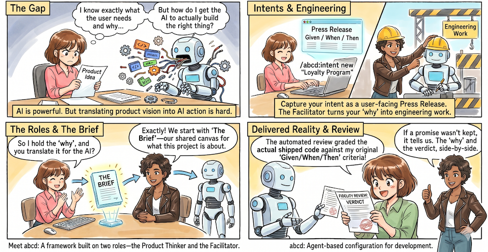

<div align="center">

  

  <h1>Agent-Based Configuration for Development</h1>

  <p>An opinionated, intent-driven development framework for <a href="https://x.com/signulll/status/2030404483897815089">product thinkers</a>.</p>

  
  <a href="https://github.com/REPPL/abcd-cli/releases"></a>
  
  <br />
  
  <a href="https://claude.ai/claude-code"></a> <!-- docs-lint: allow -->
  <br />
  
  

</div>

---

<div align="center">
  <p><a href="#roles">Roles</a> — <a href="#artefacts">Artefacts</a> — <a href="#process">Process</a> — <a href="#resources">Resources</a></p>
</div>

---

> *"This book has only one major purpose—to trigger the beginning of a new field of study: computer programming as a human activity"*
>
> —Gerald M. Weinberg, *The Psychology of Computer Programming*, 1971

AI coding is getting more powerful, yes one important group of people who most need that power — the domain experts, the [product thinkers](https://x.com/signulll/status/2030404483897815089), the people who actually know what should be built — are currently underserved to be able to use AI coding directly. `abcd`'s bet is that a small team of two roles can close that gap: A **product thinker** who holds the *why*, and a **facilitator** who translates the why into work that AI coding agents can act on.

<div align="center">
  
</div>


# Roles

`abcd` is being shaped by what real two-person teams discover as they use it. In the initial version, both roles — the product thinker and the facilitator — are human. In a later version, `abcd` aims to offer an automated facilitator, so a product thinker can run the framework with an AI translator alongside their agentic team of AI-engineers.

As a **product thinker**, you know who the user is. You know what *done* looks like when you see it. You know which trade-offs are acceptable and which would betray the point of the project. `abcd` is built around two moments where that judgement is decisive. First, at the start of a piece of work (when you set the *why* as an intent), and at the end (when you read the verdict on whether the *why* was delivered). What happens in between — turning your why into engineering work AI agents can act on — is the facilitator's job.

The **facilitator** is a *translator*, not an engineer-on-the-team in the traditional sense. Their work is to take what you wrote, shape it into plans an AI coding agent can execute well, run the framework's audit and review machinery, and tell you when the work didn't match the promise *(and what to do about it)*.

| | Product thinker | Facilitator |
|--|--|--|
| The brief — what is this project about? | bring the substance | shape it into the brief structure |
| Capturing an intent — *why does this change matter?* | write the press release | sharpen the acceptance criteria |
| Turning the why into engineering work | — | drive |
| Cross-cutting concerns the brief implies | — | derive and encode |
| Reading the verdict when work ships | read; decide what to do next | investigate any *not delivered* findings |


# Artefacts

The product thinker and facilitator collaborate on artefacts that are jointly owned, with others generated and consumed autonomously by the AI-engineering team. Two of them — an initial *briefing* document and a set of articulated *intents* — are familiar territory for product thinkers; `abcd` builds on them, and adds a third, to *carry intent through to delivered reality*.

1. The **brief** *(owned jointly by the product thinker and the facilitator)* answers *what is this whole thing about?* — purpose, scope, the vocabulary the project uses, what "good" looks like. It makes one hard promise: **Everything it says reads true right now.** On day one, when the team has agreed a design but built nothing, most of the brief is ambition — and every ambitious passage is visibly marked as not yet real. As work ships, those markings come off one by one: the change that ships a capability also rewrites its passage in the brief to describe what actually exists (which is rarely word-for-word what was planned). The brief is never re-versioned and keeps no history — version control does that — so it earns its role as the project's living canvas one shipped change at a time.

2. **Intents** *(user-facing, and thus the product thinker's domain)* answer *why does each user-facing change matter?* Each is a one-page press release written as if the change had already shipped, with a named user feeling the difference, plus acceptance criteria in plain *Given / When / Then* language. Intents are how ambition travels into the brief: An intent is drafted, planned into engineering work, and built — and the same change that ships it updates the brief. Once its acceptance criteria are verifiably met, the intent is filed as shipped and becomes the permanent record of the *why*; the brief carries the *what is*; the engineering spec carries the *how*. Intents are individually portable: Each stands on its own and can be reordered, deferred, bundled, or dropped without rewriting the bigger picture.

3. **Automated reviews** *(owned by the AI-engineering team)* grade delivered reality against the original promise. When work lands, a fidelity review reads each acceptance bullet against the actual repository and writes its verdict back onto the intent itself — so the *why* and the *did-we-deliver-it* live side by side, in one file, for as long as the project does.

Some things the project needs aren't user-facing — cross-cutting rules every feature must satisfy *(e.g., a privacy review, an accessibility checklist)*, or background plumbing that enables other capability. Those skip the press-release treatment and go straight into the brief, under the same promise: Real, or visibly marked as not yet real. As a product thinker you don't have to recognise or label them — that's your facilitator's job.


# Process

**It starts with the brief.** You sit down with your facilitator and whatever discovery material you have — recordings, notes, a shared workspace, a half-finished slide deck, a transcript of yesterday's stakeholder call. `abcd` has a skill that ingests that material and produces a plain-language draft of your project's brief; the parts that feel fuzzy, you sharpen together with a *Socratic interview* the framework provides. By the end of the session you have a brief that says — in language a stakeholder would recognise — what this project is about. Much of it is ambition rather than fact at this stage, and that's fine: The brief never bluffs, so those passages are marked accordingly.

## Capturing intents

**Ideas become intents.** From then on, whenever an idea arrives, capturing it is one line:

```bash
abcd intent "<one-line idea>"
```

Your facilitator helps sharpen the press release and its acceptance criteria — the criteria are a hard gate, not a suggestion — then turns the intent into engineering work, surfaces the cross-cutting concerns it implies, and lets AI coding agents do the building. You stay in the seat where your judgement matters most: Setting the *why* at the start, and reading the verdict at the end.

**Shipping closes the loop twice.** When the work lands, the fidelity review grades each acceptance bullet against the actual repository — the code, the configs, the tests, the docs — and writes the verdict onto the intent. And the same change updates the brief: The passage covering this capability loses its not-yet-real marking and is rewritten to describe what actually shipped. That second half is what keeps the brief honest — the true description of your project, one shipped change at a time, instead of a wish list nobody trusts.

```text
        ╭─────────────────────╮
        │  Half-formed idea   │ ◄─────────────────────────┐
        ╰─────────────────────╯                           │
                  │                                       │
                  ▼                                       │
        ┌─────────────────────┐                           │
        │  Capture as a       │                           │
        │  press release —    │                           │
        │  what does the      │                           │
        │  user feel after    │                           │
        │  this ships?        │                           │
        └─────────────────────┘                           │
                  │                                       │
                  ▼                                       │
        ┌─────────────────────┐                           │
        │  Add acceptance     │                           │
        │  criteria — how     │                           │
        │  will we tell, on   │                           │
        │  the day, whether   │                           │
        │  it was delivered?  │                           │
        └─────────────────────┘                           │
                  │                                       │
                  ▼                                       │
        ┌─────────────────────┐                           │
        │  Refine / grill —   │                           │
        │  stress-test the    │                           │
        │  why and the        │ ◄─────────┐               │
        │  criteria until     │           │               │
        │  both are clear     │           │ not yet       │
        └─────────────────────┘           │ clear enough  │
                  │                       │               │
                  ▼                       │               │
            ╱───────────╲                 │               │
           ╱  Ready to   ╲ ── No ─────────┘               │
           ╲  build it?  ╱                                │
            ╲───────────╱                                 │
                  │ Yes                                   │
                  ▼                                       │
        ┌─────────────────────┐                           │
        │  Facilitator turns  │                           │
        │  the intent into    │                           │
        │  engineering work;  │                           │
        │  AI agents build it │                           │
        └─────────────────────┘                           │
                  │                                       │
                  ▼                                       │
        ┌─────────────────────┐                           │
        │  Fidelity review    │                           │
        │  reads each         │                           │
        │  acceptance bullet  │                           │
        │  against the actual │                           │
        │  shipped repo       │                           │
        └─────────────────────┘                           │
                  │                                       │
                  ▼                                       │
        ┌─────────────────────┐                           │
        │  Shipped — verdict  │         next idea         │
        │  on the intent; the │ ─────────────────────────►┘
        │  brief passage is   │
        │  rewritten to what  │
        │  now exists         │
        └─────────────────────┘
```

Acceptance criteria for each intent use three words to describe a checkable outcome.

|  | What it pins down |
|------|-------------------|
| **Given** | The starting state — what's already true before anything happens. |
| **When** | The trigger — a single user or system action. |
| **Then** | The observable outcome — something a human (or the fidelity reviewer) can check by *looking at the result*, not by reading the author's intent. |

The reviewer is allowed to fail honestly. If a promise wasn't kept, it says so. If something was delivered but with a wrinkle worth your attention, it flags the wrinkle rather than glossing it. And if it genuinely couldn't tell from the repo, it says *that* — which is different from saying the promise wasn't met, and `abcd` insists on the distinction.

## Capturing issues & thoughts

While intents are at the core of `abcd`, you will sometimes find that a thought that *feels* relevant crosses your mind — a half-formed observation, a question for the team, a doubt about the brief, a behaviour you'd expect a user to notice — and you don't want to lose it. Instead of articulating an intent, `abcd` has a fast hatch for capturing it:

```bash
abcd capture "<whatever crossed your mind>"
```

One line, deliberately shaped like intent capture but for un-typed thoughts: `abcd capture` writes one small record into the repo's issue ledger (`.abcd/work/issues/open/`), minted with the next free id. Everything else — severity, category, where it was found — has sensible defaults, so you don't have to decide anything beyond the text itself at this stage.

`abcd capture` essentially decouples retention from classification. Intents demand press-release discipline — a named user, acceptance criteria, a *why*. Forcing a half-formed doubt through that discipline either kills the thought (too much ceremony, you let it go) or pollutes the intent corpus (you file something vague to avoid losing it). The *fast hatch* makes retention almost free — seconds, zero decisions — and defers the "*what is this?*" question to someone in the right seat at the right time.

That "someone" is your technical facilitator, who triages those captures later: They sweep the open captures and route each one — a bug gets fixed (finding first, fix after); a feature seed gets promoted into an intent draft; a doubt about the brief becomes a brief correction; a deliberate non-action goes to `wontfix` with the reasoning recorded, so the question never gets re-litigated.


# Resources

## Install

One line, checksum-verified. It detects your OS/architecture, downloads the
binary and the `checksums.txt` manifest from the latest release, verifies the
binary's SHA-256 against the manifest (and refuses to install on any
mismatch — or if the manifest doesn't list the binary at all), then installs
to `/usr/local/bin`:

```sh
sh -c 'set -eu; cd "$(mktemp -d)"; os=$(uname -s | tr "[:upper:]" "[:lower:]"); arch=$(uname -m); case "$arch" in x86_64) arch=amd64;; aarch64) arch=arm64;; esac; b="abcd-$os-$arch"; curl -fsSLO "https://github.com/REPPL/abcd-cli/releases/latest/download/$b"; curl -fsSLO "https://github.com/REPPL/abcd-cli/releases/latest/download/checksums.txt"; grep " $b$" checksums.txt | if command -v sha256sum >/dev/null; then sha256sum -c -; else shasum -a 256 -c -; fi; sudo install -m 0755 "$b" /usr/local/bin/abcd; abcd version'
```

Prefer to inspect before running? The command is exactly what it says: two
downloads from [the latest release](https://github.com/REPPL/abcd-cli/releases/latest),
a checksum verification, and a `sudo install`. You can do the same by hand —
grab the binary for your platform plus `checksums.txt` from the releases
page, run `shasum -a 256 -c` (or `sha256sum -c`) against the matching line,
and copy the binary anywhere on your `PATH`. Every release is built and
published by CI from the exact tagged commit, with the checksums generated
over the same bytes that are uploaded.

## Plugin

This repository is also its own plugin marketplace, so a compatible agent
harness can install the `/abcd:*` surface — the commands under
[`commands/`](commands/), the agents under [`agents/`](agents/) and the hook
wiring in [`hooks/`](hooks/) — straight from it. Add the marketplace, then
install the plugin:

```text
/plugin marketplace add REPPL/abcd-cli
/plugin install abcd@abcd-marketplace
```

`abcd-marketplace` is the marketplace name declared in
[`.claude-plugin/`](.claude-plugin/); `abcd` is the single plugin it lists,
sourced from the repository root. Pull the current state of the marketplace with:

```text
/plugin update abcd
```

The marketplace is served from the repository itself, so an install tracks the
repository rather than a versioned artefact: the manifests here carry no version
key, and a release publishes the `abcd` binaries and their checksums. The
commands drive the `abcd` binary, so keep the [install](#install) above in place
alongside the plugin.

## Build

```bash
make preflight   # build + vet + test + race (the pre-push gate)
go run ./cmd/abcd            # bare status board for the current directory
go run ./cmd/abcd version    # print the version
make build                   # cross-compile bin/abcd-<goos>-<arch>
```

## Layout

- [`cmd/abcd/`](cmd/abcd/) — CLI entry point.
- [`internal/`](internal/) — the engine (`core/`) and front doors (`surface/`);
  see [`internal/README.md`](internal/README.md).
- [`commands/`](commands/), [`.claude-plugin/`](.claude-plugin/) — the plugin
  surface (auto-loaded).
- [`.abcd/`](.abcd/) — the development record and working files (never shipped).

Contributor guidance: [`AGENTS.md`](AGENTS.md).
